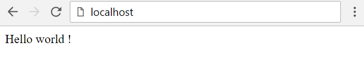

# Hello world

Dans ce tutoriel, il est présenté la création d'une application n'affichant que le célèbre message 'Hello world' dans une page.

## Création du projet

D'abord, créons le projet à l'aide de l'outil npm via les commandes suivantes.

```
npm init -y 
npm install typescript --save-dev 
npm install artistejs --save 
./node_modules/.bin/tsc --init 
```

Remplaçons le contenu du fichier tsconfig.json qui vient d'être créé par le code suivant.

```javascript
{ 
    "compilerOptions": { 
        "module": "amd", 
        "moduleResolution": "classic", 
        "experimentalDecorators": true, 
        "emitDecoratorMetadata": true, 
        "baseUrl": "./src", 
        "outDir": "./dist", 
        "lib": [ 
            "es2016", 
            "dom" 
        ] 
    }, 
    "include" : [ 
        "./src/**/*.ts" 
    ], 
    "exclude" : [ 
        "./node_modules" 
    ] 
}
```

Créons un fichier index.html à la racine du projet.

```html
<!DOCTYPE html> 
<html> 
    <head> 
        <meta charset="utf-8" /> 
        <meta http-equiv="X-UA-Compatible" content="IE=edge" /> 
        <meta name="viewport" content="width=device-width, initial-scale=1.0" /> 
        <script src="node_modules/artistejs/dist/artiste.js" config="dist/config" startup="dist/startup" placeholder="[app]"></script> 
    </head> 
     
    <body> 
        <div app></div> 
    </body> 
</html>
```

Créons ensuite deux dossiers

- _src_ : qui contiendra le code source de l'application.
- _dist_ : qui contiendra le code distribué de l'application.

Dans le répertoire dist, créons un dossier template pour y mettre tous les fichier de template html. Ensuite créons un fichier layout.html dans le répertoire template.

```html
<div> 
    Hello world ! 
</div>
```

Enfin, dans le répertoire _src_, créons un fichier startup.ts.

```typescript
import { View } from 'node_modules/artistejs/dist/artiste'; 
 
@View<Startup>({ 
    template: "dist/template/layout.html", 
    binding: { 
    } 
}) 
export class Startup { 
    private observable: { view: any }; 
     
    constructor() { 
    } 
} 
```
 
 Et config.ts

```typescript
export default { 
    path: [ 
        { test: /^\/?(node_modules\/*)/, result: "$1" }, 
        { test: /^\/?artiste/, result: "node_modules/artistejs/dist/artiste" } 
    ] 
};
```

Compilons le projet à l'aide de la commande suivante.

```
./node_modules/.bin/tsc
```

Puis ouvrons le fichier index.html dans un navigateur web. Rien ne se passe. Ouvrons la console du navigateur pour constater le message d'erreur suivant.

> Failed to load file:///C:/dist/template/layout.html: Cross origin requests are only supported for protocol schemes: http, data, chrome, chrome-extension, https.

Ce message signifie que le navigateur a essayer d'effectuer un appel ajax avec un protocol non autorisé. Pour palier cela, il faut installer un serveur sur son poste.
Installons un serveur node que nous lancerons sur le port 80.

```
npm install http-server --save-dev 
node node_modules/http-server/bin/http-server -p 80
```

Ouvrons à nouveau le navigateur et allons à l'adresse [http://localhost](http://localhost/). Nous devons voir apparaitre la page suivante.

