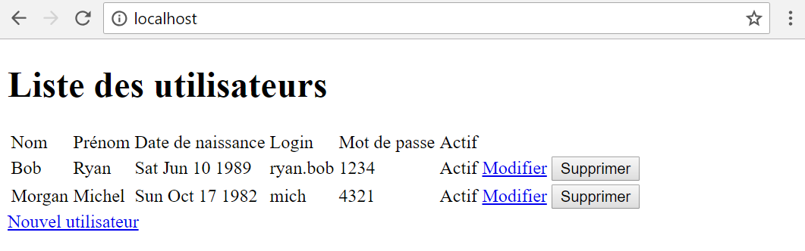

# Gestion des utilisateurs

Dans ce tutoriel, il est présenté la création d'une application de gestion des utilisateurs à l'aide d'Artist.

L'application devra permettre de créer, modifier, supprimer un utilisateur et d'afficher la liste de tous les utilisateurs.

Un utilisateur est défini comme une personne possédant un nom, un prénom, une date de naissance et ayant un compte d'identification (login, mot de passe) actif ou inactif.

L'application comportera 3 écrans :

-  Un écran de création d'un utilisateur.
-  Un écran de modification d'un utilisateur.
-  Un écran d'affichage de la la liste des utilisateurs.

## Création du projet

Reprenons le projet du tutoriel [Hello world](hello-world.md).

## Modèle de l'application

Nous commencerons d'abord à concevoir le modèle de l'application en créant les objets représentant les utilisateurs. Créons le fichier _user.ts_ dans un nouveau répertoire _src/model_.

_user.ts_
```typescript
export class User { 
    public id: number; 
    public firstName: string; 
    public lastName: string; 
    public birthdate: Date; 
    public login: string; 
    public password: string; 
    public actif: boolean;
}
```

## CRUD

Ensuite créons le service qui permettra de manipuler les objets précédemment créés. Ce service fournira les opérations de création, lecture, mise à jour et suppression. Créons un fichier _userService.ts_ dans le répertoire _src/service_.

_userService.ts_
```typescript
import { Service } from 'node_modules/artist/dist/artist'; 
import { User } from '../model/user'; 
 
export abstract class IUserService { 
    abstract create(user: User); 
    abstract update(user: User); 
    abstract listAll(): User[]; 
    abstract remove(user: User); 
}

@Service({
    key: IUserService
})
class UserService extends IUserService {
    private users: User[];
    private id: number;
    constructor() {
        super();
        this.users = [];
        this.id = 1;

        // création de quelques tests
        this.create({
            id: undefined,
            firstName: 'Ryan',
            lastName: 'Bob',
            birthdate: new Date(1989, 5, 10),
            login: 'ryan.bob',
            password: '1234',
            actif: true
        });

        this.create({
            id: undefined,
            firstName: 'Michel',
            lastName: 'Morgan',
            birthdate: new Date(1982, 9, 17),
            login: 'mich',
            password: '4321',
            actif: true
        });
    }

    create(user: User) {
        var usr = new User();
        usr.id = this.id++; 
        usr.firstName = user.firstName; 
        usr.lastName = user.lastName; 
        usr.birthdate = user.birthdate; 
        usr.login = user.login; 
        usr.password = user.password; 
        usr.actif = user.actif;
        this.users.push(usr);
    }

    update(user: User) {
        var usr = this.users.filter(u => u.id !== user.id)[0];
        if (usr) {
            usr.id = user.id; 
            usr.firstName = user.firstName; 
            usr.lastName = user.lastName; 
            usr.birthdate = user.birthdate; 
            usr.login = user.login; 
            usr.password = user.password; 
            usr.actif = user.actif;
        }
    }

    listAll(): User[] {
        return this.users;
    }

    remove(user: User) {
        this.users = this.users.filter(u => u.id !== user.id);
    } 
}
```

## Première page - liste des utilisateurs

Cet écran liste tous les utilisateurs. Il permet de supprimer un utilisateur et d'acceder aux écrans d'ajout et de modification d'un utilisateur.

Créons un fichier _user.html_ dans un répertoire _dist/template_.

_user.html_
```html
<div> 
    <h1>Liste des utilisateurs</h1> 
    <table> 
        <thead> 
            <tr> 
                <td>Nom</td> 
                <td>Prénom</td> 
                <td>Date de naissance</td> 
                <td>Login</td> 
                <td>Mot de passe</td> 
                <td>Actif</td> 
            </tr> 
        </thead> 
        <tbody> 
            <tr> 
                <td data-id="last-name"></td> 
                <td data-id="first-name"></td> 
                <td data-id="birthdate"></td> 
                <td data-id="login"></td> 
                <td data-id="password"></td> 
                <td data-id="actif"></td> 
            </tr> 
        </tbody> 
    </table> 
</div>
```
Créons un fichier _user.ts_ dans un répertoire _src/view_.

_user.ts_
```typescript
import { View, IObservablizer, each, text } from 'node_modules/artist/dist/artist'; 
import { User as UserModel } from '../model/user'; 
import { IUserService } from '../service/userService';
 
export abstract class IUser {} 
 
@View<User>({ 
    template: "dist/template/user.html", 
    binding: { 
        "tbody": (userView) => each(() => { 
            return userView.observable.list.map(user => { 
                return { 
                    "[data-id=first-name]": text(() => user.firstName), 
                    "[data-id=last-name]": text(() => user.lastName), 
                    "[data-id=birthdate]": text(() => user.birthdate.toString()), 
                    "[data-id=login]": text(() => user.login), 
                    "[data-id=password]": text(() => user.password), 
                    "[data-id=actif]": text(() => user.actif ? 'Actif' : 'Inactif') 
                }; 
            }); 
        }) 
    } 
}) 
class User extends IUser { 
    private observable: { list: UserModel[] }; 
     
    constructor(observablizer: IObservablizer, userService: IUserService) { 
        super(); 
        this.observable = observablizer.convert({ list: [] }); 
        this.observable.list = userService.listAll();
    } 
}
```

Modifions le fichier _startup.ts_ comme suit.

```typescript
import { View, IObservablizer, view } from 'node_modules/artist/dist/artist'; 
import { User as UserView } from 'view/user';
 
@View<Startup>({ 
    template: "dist/template/layout.html", 
    binding: { 
        "this": (starter) => view(() => starter.observable.view)
    } 
}) 
export class Startup { 
    private observable: { view: any }; 
     
    constructor(
        // services
        observablizer: IObservablizer,
        
        // sous vues
        private listView: UserView
    ) {
        this.observable = observablizer.convert({ view: listView }); 
    } 
} 
```

Compilons le projet et rendons nous à la page [http://localhost](http://localhost/).  Nous devons voir apparaitre la page suivante.

